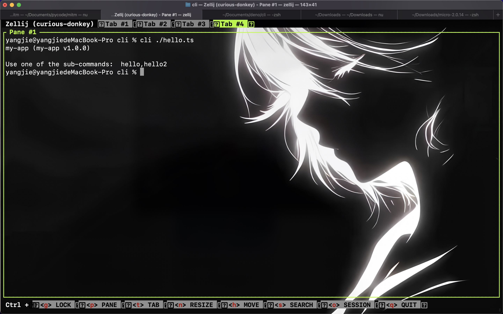
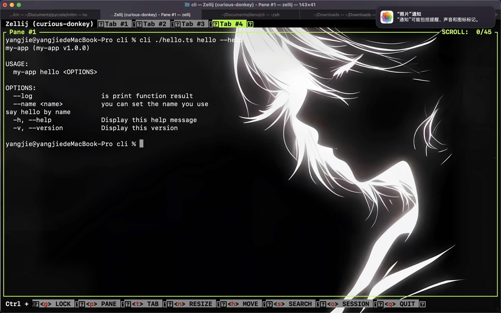
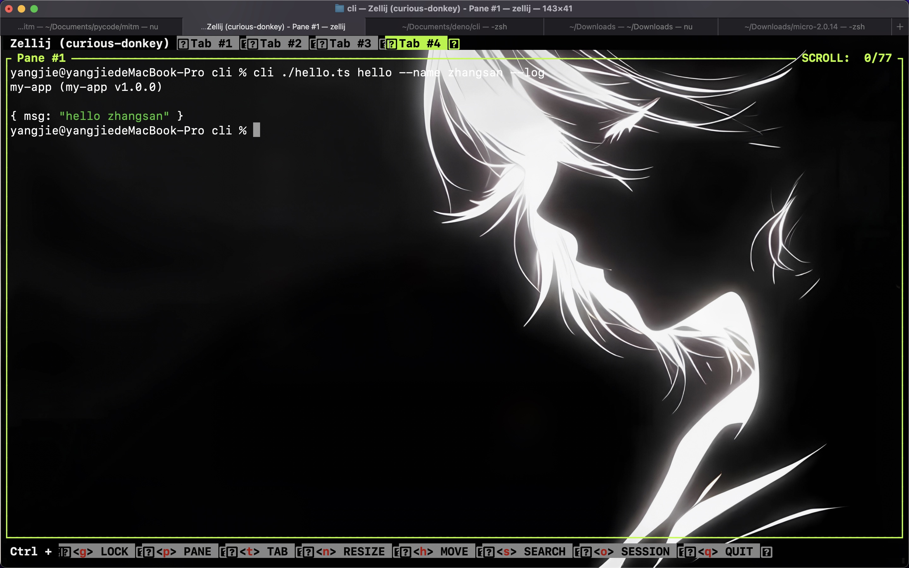

> 0行代码制作命令行程序


# 通过jsdoc 为文件或者模块 生成cli 并调用cli


# 安装
```shell
deno install -A -g --name  cli jsr:@24wings/cli/cli.ts


例如 你的代码
```typescript
// my_hello.ts

/**
@param name  you can set the name you use
*/
export function hello(name:string){
    return {msg:`hello ${name}`}
}

/**
@param name  you can set the name you use2
*/
export function hello2(name:string){
    return {msg:`hello ${name}`}
}


```
其中`@param name` 不是必须的,如果编写则会变成参数的文档 也是命令行的参数的文档
你可以直接以命令行的形式运行

```nushell

cli  ./my-hello.ts  --help
```


会列出模块中的所有函数作为子命令

也可以执行子命令查看文档
```nushell
cli ./my-hello.ts hello --help

```



-log 是生成的内置命令,用于打印函数的结果
```nushell
  cli ./my-hello.ts hello --name zhangsan -log
```


```nushell
cli jsr:@std/path dirname --help
```


# 原理
通过deno doc --json 转换为文档对象 并转换为 `gunshi`的cli参数

# 待新增的特性
- [ ] 可选参数与cli 可选参数映射
- [ ] 支持参数复杂对象
- [ ] 输出格式 json ,xml,jsonl,
- [ ] logtap类日志库的约束输出
- [ ] 更好的配合nushell使用
